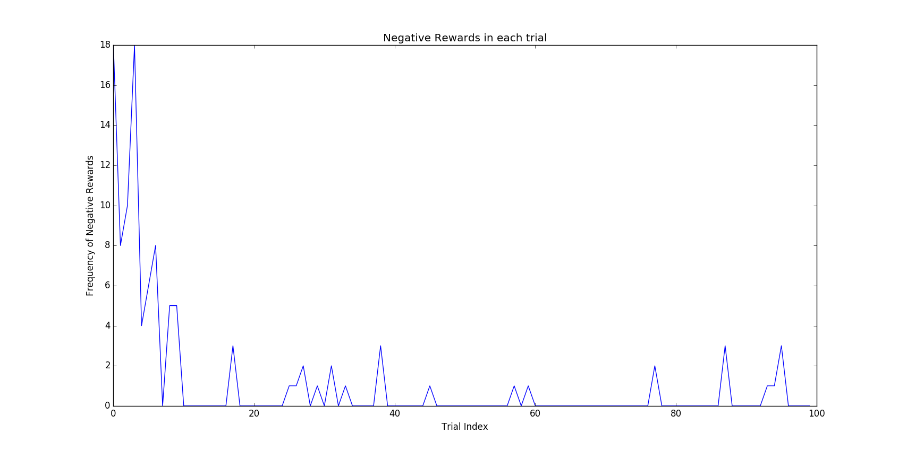

Project 4: Train a Smartcab
==========================

Training a smartcab using Reinforcement Learning

Task 1
======
### Implement a basic Learning Agent
Actions are randomly choosen at each iteration using **```random.choice(available_actions)```**
```
if inputs['light'] == 'red':
            """
                Red Light means :
                    Left when no oncoming traffic
                    No action
            """
            if inputs['oncoming'] != 'left':
                available_actions = [None, 'right']
        else:
            """
                Green Light means :
                    Left only if no forward oncoming traffic
                    Perform atleast some action
            """        
            available_actions = ['right', 'left', 'forward']
            if inputs['oncoming'] == 'forward':
                available_actions.remove('left')
        action = None
        if available_actions != []:
            action = random.choice(available_actions)
```
### ***Q1. Mention what you see in the agent’s behavior. Does it eventually make it to the target location?***
The output as a result of the random movement algorithm (```/smartcab/test_random.txt```):
<br>
>**32 trips out of the 100, the cab reaches the destination.**<br>

The agent is able to reach the destination more than 25% of the trips while still following all the traffic rules.
It does eventually make it to the target location however since it wasn't behaving intelligently at any point of time, hence it has a very low success rate. This was when I set ```enforce_deadline = True```
<br>
When the deadline is not enforced, 
>**81 trips out of the 100, the cab reaches the destination.**<br>

The behaviour was as expected because the randomised movements will take the cab to the destination however in majority of the cases not under the deadline. 
### ***Q2. Identify and Update State. Justify why you picked these set of states, and how they model the agent and its environment.***
I chose the parameters **```oncoming```**, **```left```**, **```light```**, and **```the next waypoint```** to represent the state of the agent at an instance. I chose these parameters because:
* **```oncoming```** and **```left```**: The agent needs to know about any traffic which is oncoming or coming in from the left as it has to yield to cars on these roads according to the traffic rules.
* **```light```**: Very important paramter as the first motive of our agent is to follow the traffic rules.
* **```next_waypoint```**: For knowledge of the route the agent has to take.

The agent can be modeled using the above state variables, efficiently.
I believe that the deadline shouldn't be big enough factor to make it a part of the state. Our primary concern with the agent is to follow the traffic rules. Even in real life traffic rules are a higher priority than reaching somewhere within a time. I also believe that the agent learns to follow the optimised path after sufficient learning. Another fact is that taking the deadline as part of the state increase the size of the state space. This makes learning more difficult.
Task 2
========
### Implement Q Learning
The Q Learning algorithm I followed is exactly as mentioned in the video Lectures. <br>
The state is represented by the input parameters **```oncoming```** and **```light```**, and **```the next waypoint```**. These three represent the exact state of the cab at a point of time. The primary aim is to train the cab for performing legal moves. Legal moves result in the highest possible reward. Even in real life, following the traffic rules is slightly more important than reaching before the deadline. Therefore in this case I haven't included the deadline as a state variable.
The Q Learning Algorithm is explained below : 
> 1. Construct the State Representation
> 2. Obtain Action for that state
    1. Random action is choosen with epsilon probability.
    2. Otherwise choose action using the policy of greatest q value gives best action.
> 3. Update Q Values according to reward by the action.

### ***Q3. What changes do you notice in the agent’s behavior ?***
After running ```agent.py``` I found out that the agent is now considerably more accurate than the random agent. Tests revealed a success rate of ***97/100***```(/smartcab/test_q_100.txt)```. In a seperate test with number of trials = 200,  the agent reached the target ***195/200***```(/smartcab/test_q_200.txt)``` times. The agent behaves intelligently at every decision point, based on the q values. Randomness has been minimised by setting a very low epsilon. <br>
To get a more clear understanding I have plotted the number of negative rewards in each trial of the Random Agent along with the Q Learning Enabled Agent:

It is clear that the Q Learning agent still makes some mistakes. However it learns very well from the initial trials and hence the number of penalties is reduced significantly as the number of trials increase. The Q Learning Agent is way better than the Random Agent because the Random Agent obviously doesn't learn anything from the previous trials.
This graph is very useful to understand the performance of the Q Learning Agent as compared to the Random Agent.
### *** Q4. Report what changes you made to your basic implementation of Q-Learning to achieve the final version of the agent. How well does it perform?***
The parameters of the initial implementation of the Q Learning Algorithm were totally random at **alpha = 0.5**, **gamma = 0.5**, **epsilon = 0.5**, and **initial Q Value = 20.0**. 
Following table shows the various parameters I tested the Q LEarning agent with: 

|**S.No.**|**Alpha**|**Gamma**|**Epsilon**|**Q_Initial**|**Successful Trips (out of 100)**|
|:-------:|:-------:|:-------:|:---------:|:-----------:|:-------------------------------:|
|1|0.5|0.5|0.5|20.0|57|
|2|0.6|0.4|0.25|20.0|82|
|3|0.8|0.1|0.125|19.75|93|
|2|0.9|0.35|0.001|19.75|97|

After a host of testing with various parameters, I arrived at the optimal parameters:
* **alpha = 0.9**: High learning rate is desirable
* **epsilon = 0.001**: Provides sufficient amount of randomness in the selection of an action. Our aim is to obtain maximum actions from the learning policy.
* **gamma = 0.35**: Brute Force
* **Initial Q Value = 19.75**: Brute Force<br>

As mentioned above the algorithm performs better as compared to the random agent. **97 out of 100** is a remarkably good accuracy for a smart cab. Another fact we can observe from the above graph

### ***Q5. Does your agent get close to finding an optimal policy, i.e. reach the destination in the minimum possible time, and not incur any penalties?***
The agent is able to form a very good policy after just a few number of trials. However by the end of 100 trials, the agent still obtains a negative reward in some iterations in the last few trials. The negative rewards in the 3 trials where the cab didn't reach the destination (Trial 0, 2, 3) are very high which was expected.<br>
In conclusion I would say that the policy is still not the most optimal one. An optimal policy by definition is the one that never violates the traffic rules and still reaches the destination in majority of the trials(say like 95%). **An optimal agent would always try to perform a legal move**. This agent is not able to achieve that rate of success. Hence I wouldn't call it an optimal policy. 
